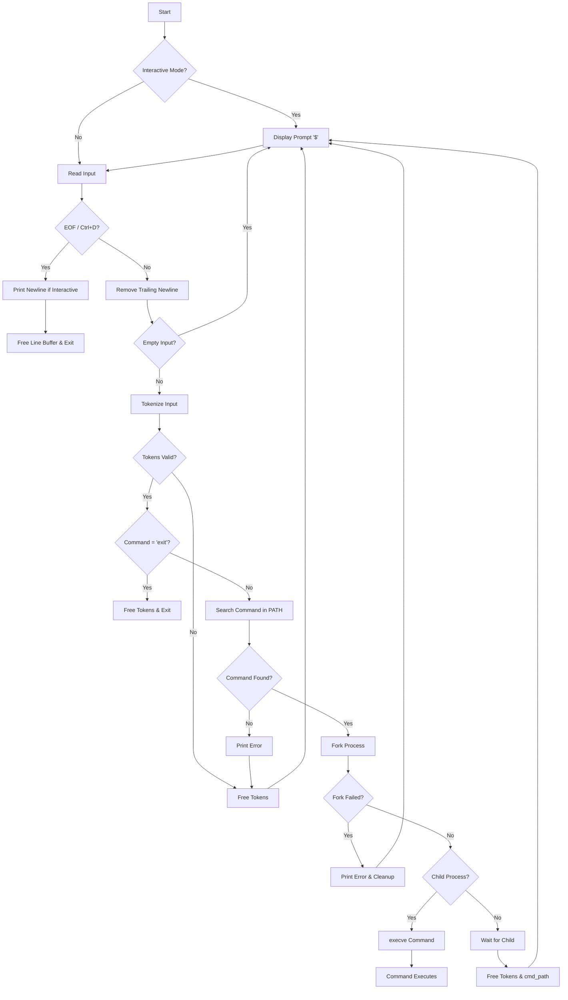

# Simple Shell

> A command-line interpreter that lets Linux and Unix users control their operating systems through a simple shell interface.

<p align="center">
  
  
  
</p>

---

## Quick Start

```bash
git clone https://github.com/starfruitone/holbertonschool-simple_shell.git
cd holbertonschool-simple_shell
./hsh
```

> **Note:** The repository includes a pre-compiled binary (`hsh`). To compile it yourself, remove the existing binary first with `rm hsh`, then run the compile command below.

---

## Compilation

```bash
gcc -Wall -Werror -Wextra -pedantic -std=gnu89 *.c -o hsh
```

---

## Usage

### Interactive Mode

```bash
$ ./hsh
$ ls
AUTHORS  hsh  main.c  README.md  shell.h  tokenizer-pro-max.c
$ pwd
/home/user/holbertonschool-simple_shell
$ echo Hello World
Hello World
$ env
USER=user
HOME=/home/user
PATH=/usr/local/bin:/usr/bin:/bin
...
$ exit
```

### Non-Interactive Mode

```bash
$ echo "ls" | ./hsh
$ echo "pwd" | ./hsh
$ cat commands.txt | ./hsh
```

---

## Built-in Commands

| Command | Description |
|:-------:|:------------|
| `exit`  | Exit the shell |

---

## Flowchart

<details>
<summary>Click to expand</summary>



</details>

---

## File Structure

| File | Description |
|:-----|:------------|
| `main.c` | Entry point, main loop, PATH search, command execution |
| `tokenizer-pro-max.c` | Tokenizes user input into argument array |
| `shell.h` | Header file with function prototypes and includes |
| `man_1_simple_shell` | Manual page for the shell |

---

## Requirements

| Requirement | Details |
|:------------|:--------|
| Editors | `vi`, `vim`, `emacs` |
| Compiler | `gcc` on Ubuntu 20.04 LTS |
| Flags | `-Wall -Werror -Wextra -pedantic -std=gnu89` |
| Style | Betty |
| Memory | No leaks |
| Functions | Max 5 per file |
| Headers | Include guarded |

---

## Man Page

```bash
man ./man_1_simple_shell
```

---

## Authors

<table>
  <tr>
    <td align="center">
      <a href="https://github.com/starfruitone">
        <b>Alexander Durant</b>
      </a>
    </td>
    <td align="center">
      <a href="https://github.com/Nano420x">
        <b>Nano420X</b>
      </a>
    </td>
  </tr>
</table>
